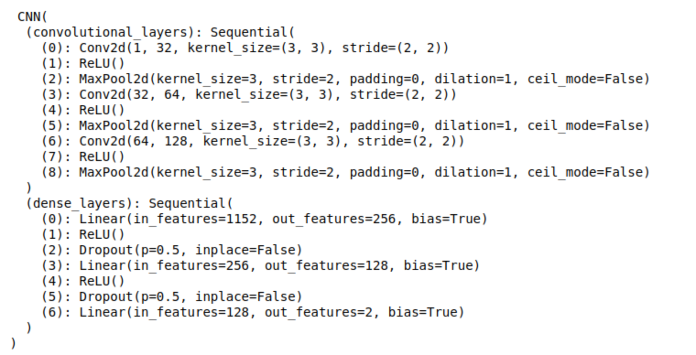
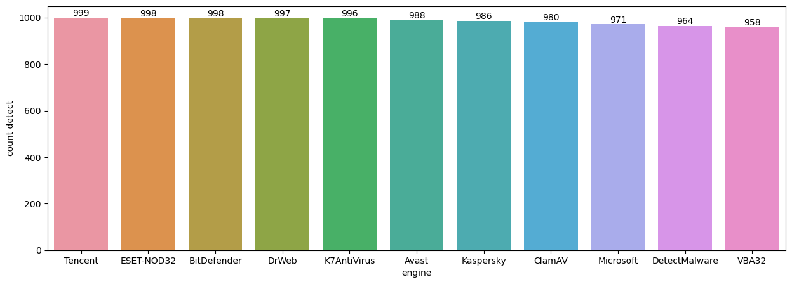

# DetectMalware
## Description
DetectMalware is a project for detecting malicious PE format files using deep learning technologies.
## Objectives
DetectMalware implements binary classification into malicious and benign files, and then multiclass classification by type of malicious context.
## Features
1. The input files of the dataset are checked by signature for compliance with the PE format.
Next, the function of checking for the presence of file packaging types is implemented: ASPack, FSG, MEW, EMPRESS, PEtite, UPX, YZPack.
2. The unpacked files are converted into 256 by 256 pixel png images. 

## Architecture CNN

## Classification of the validation sample
The validation sample size is 1000 files. Received reports on file scanning on the `VirusTotal` service.
The table compares DetectMalware with other antivirus engines. 

## Typical Usage
### Running the application from the command line
DetectMalware can be run using the command line with parameters. There are two types of action:
1. learn: Neural network training for two types of classification.
2. predict: It is necessary to pass the path to the file or directory for classification as a parameter.
In the case of a malicious prediction for a file, a multiclass classifier makes a prediction for the type of malicious file (Trojan, Spyware, and others).
### Starting a web server using FastAPI
Implemented a `POST` request to check files. The server is started using `uvicorn` at IP-address https://127.0.0.1:8000/
